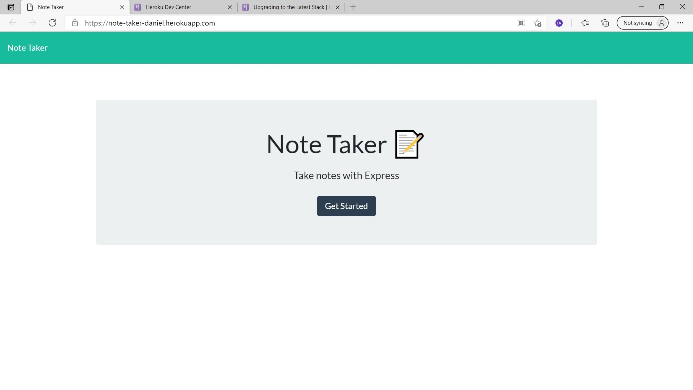

# Team Profile Builder - Bootcamp Spot - Homework #
## Author: WellAndGood

# Table of Contents
* [Overview](#overview)
* [Appearance](#appearance)
* [Features](#features)
* [Files](#files)
* [Contributors](#contributors)
* [License](#license)

# Overview

This document describes the components of a note-taker app using vanilla Javascript, Node, Express, Path, and FS. 

# Appearance 
Once loaded, the generated HTML page should look like this:  

Clicking on the 'Get Started' button brings you to the main application page, which looks like this:   

You can access the `.git` files at:
https://github.com/WellAndGood/NoteTakerApp.git

A video explaining the functioning of this app can be found here:
https://note-taker-daniel.herokuapp.com/ 

# Features

Hit the 'Get Started' button to be brought to the main feature of the application.
On the left side of the screen, you are given a list of previously-entered notes. These are obtained using the GET method against the app's API endpoint.

The right side of the screen is an input for a note title and note body. As you type into these fields, a save icon appears on the top right; clicking it allows you to save your note and commit it to the API using the POST method.

Every saved note has a trash icon; clicking its respective icon eliminates the icon from the API using the DELETE method.

## Bugs

Though it might not appear evident, the GET, POST, and DELETE methods work; through the localhost, one must reboot the server to allow the new information to refresh. Clicking the save or delete buttons *do* update the JSON data inside the `db` folder.

The instructors have stated that this is a bug related to the construction of the in-built Javascript files, and are not in the pervue of this homework.

# Files

File name | Function
------------ | -------------
server.js | Javascript file with GET, POST, and DELETE methods
package.json (and package-lock.json)
**db**
db.json | Starter JSON file 
**public**
index.js | Javascript file
styles.css | CSS file
index.html | Home Page
notes.html | App Page
**utils**
.gitignore

**How to contribute to the application**: Given that this application acts as homework, please do not contribute to this repository.

## Contributors
Daniel Pisani (WellAndGood)

# Contact
* GitHub account: WellAndGood

## License
This project is licensed under:

### MIT License

Copyright (c) 2021 Daniel Pisani (WellAndGood) 

Permission is hereby granted, free of charge, to any person obtaining a copy of this software and associated documentation files (the "Software"), to deal in the Software without restriction, including without limitation the rights to use, copy, modify, merge, publish, distribute, sublicense, and/or sell copies of the Software, and to permit persons to whom the Software is furnished to do so, subject to the following conditions:

The above copyright notice and this permission notice shall be included in all copies or substantial portions of the Software.

THE SOFTWARE IS PROVIDED "AS IS", WITHOUT WARRANTY OF ANY KIND, EXPRESS OR IMPLIED, INCLUDING BUT NOT LIMITED TO THE WARRANTIES OF MERCHANTABILITY, FITNESS FOR A PARTICULAR PURPOSE AND NONINFRINGEMENT. IN NO EVENT SHALL THE AUTHORS OR COPYRIGHT HOLDERS BE LIABLE FOR ANY CLAIM, DAMAGES OR OTHER LIABILITY, WHETHER IN AN ACTION OF CONTRACT, TORT OR OTHERWISE, ARISING FROM, OUT OF OR IN CONNECTION WITH THE SOFTWARE OR THE USE OR OTHER DEALINGS IN THE SOFTWARE.