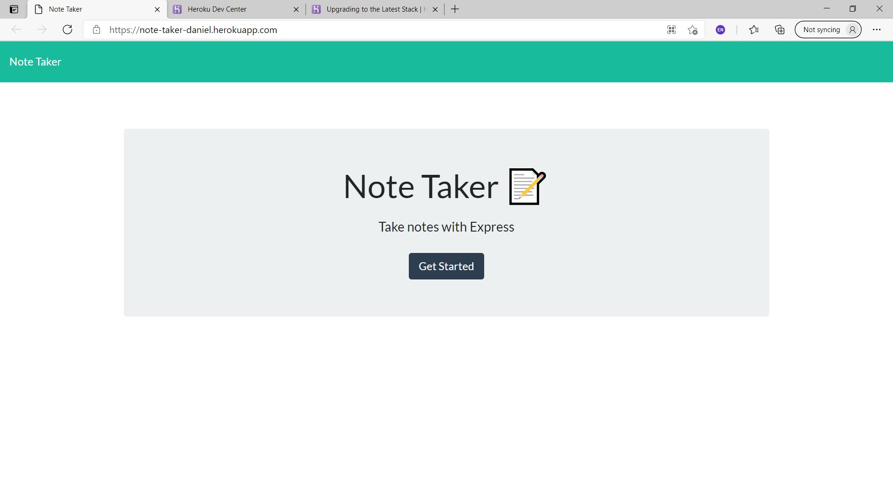

# Team Profile Builder - Bootcamp Spot - Homework #
## Author: WellAndGood

# Table of Contents
* [Overview](#overview)
* [Features](#features)
* [Files](#files)
* [Appearance](#appearance)
* [Contributors](#contributors)
* [License](#license)

## Overview

This document describes the components of a note-taker app using vanilla Javascript, Node, Express, Path, and FS. 

# Files

File name | Function
------------ | -------------
server.js | Javascript file with GET, POST, and DELETE methods
package.json (and package-lock.json)
**db**
db.json | Starter JSON file 
**public**
index.js | Javascript file
styles.css | CSS file
index.html | Home Page
notes.html | App Page
**utils**
.gitignore

# Appearance 
Once loaded, the generated HTML page should look like this:  

Clicking on the 'Get Started' button brings you to the main application page, which looks like this:   

You can access the `.git` files at:
https://github.com/WellAndGood/NoteTakerApp.git

A video explaining the functioning of this app can be found here:
https://note-taker-daniel.herokuapp.com/ 

**How to contribute to the application**: Given that this application acts as homework, please do not contribute to this repository.

## Contributors
Daniel Pisani (WellAndGood)

# Contact
* GitHub account: WellAndGood

## License
This project is licensed under:

### MIT License

Copyright (c) 2021 Daniel Pisani (WellAndGood) 

Permission is hereby granted, free of charge, to any person obtaining a copy of this software and associated documentation files (the "Software"), to deal in the Software without restriction, including without limitation the rights to use, copy, modify, merge, publish, distribute, sublicense, and/or sell copies of the Software, and to permit persons to whom the Software is furnished to do so, subject to the following conditions:

The above copyright notice and this permission notice shall be included in all copies or substantial portions of the Software.

THE SOFTWARE IS PROVIDED "AS IS", WITHOUT WARRANTY OF ANY KIND, EXPRESS OR IMPLIED, INCLUDING BUT NOT LIMITED TO THE WARRANTIES OF MERCHANTABILITY, FITNESS FOR A PARTICULAR PURPOSE AND NONINFRINGEMENT. IN NO EVENT SHALL THE AUTHORS OR COPYRIGHT HOLDERS BE LIABLE FOR ANY CLAIM, DAMAGES OR OTHER LIABILITY, WHETHER IN AN ACTION OF CONTRACT, TORT OR OTHERWISE, ARISING FROM, OUT OF OR IN CONNECTION WITH THE SOFTWARE OR THE USE OR OTHER DEALINGS IN THE SOFTWARE.